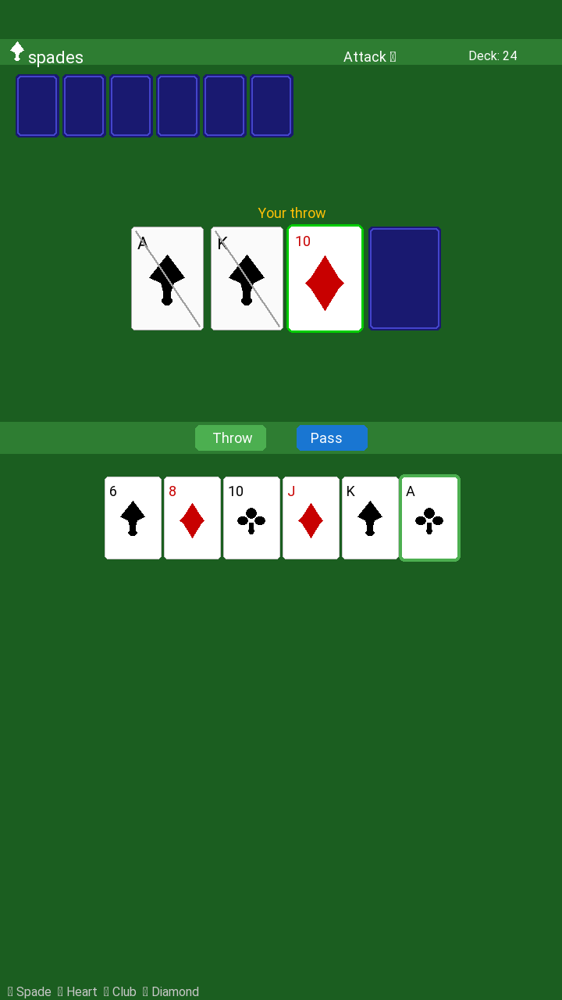

# Дурак (Fool Card Game) — Android

Повноцінна Android-реалізація класичної російської карткової гри **«Дурак (підкидной)»**. Котлін, Canvas-рендеринг карт — жодних зовнішніх зображень.

## Особливості

- **Справжні правила**: перша карта будь-яка, далі підкидання за мастю/рангом, захист старшою картою тієї ж масті або козирем
- **Штучний інтелект**: AI атакує, захищається й підкидає карти за правилами
- **Підкидання**: після успішного відбою атакуючий може підкидати карти, що збігаються за рангом із будь-якою картою на столі
- **Зміна ролей**: захисник, який відбив усі карти, стає атакуючим
- **Козир**: випадкова масть на початку гри, показана зверху
- **Canvas-карти**: без зображень — усі карти малюються програмно з символами мастей (♠♥♣♦) і правильними кольорами
- **Edge-to-edge**: коректно працює на Android 15+ з урахуванням системних панелей
- **Легкий APK**: ~3.4 МБ, без зовнішніх залежностей, крім AppCompat

## Як грати (Підкидной дурак)

1. **Атака**: натисніть будь-яку карту в руці → **Attack**
2. **Захист**: коли AI атакує, натисніть карту, якою можете побити → **Beat** або **Take**, щоб узяти карти
3. **Підкидання**: після відбою карти AI натискайте карти збіжного рангу → **Throw** або **Pass** для зміни ролей
4. **Перемога**: скиньте всі карти першим. Той, у кого залишилися карти — «дурак»

## Скріншот



## Збірка

```bash
git clone https://github.com/santoni-star/fool-game
cd fool-game
export ANDROID_HOME=~/android-sdk
./gradlew assembleDebug
```

APK у `app/build/outputs/apk/debug/app-debug.apk`.

## Технології

- **Kotlin** — уся логіка гри в чистому Kotlin
- **Android SDK 36** — цільовий API 36 (Android 16)
- **Canvas** — CardView малює карти напряму на Canvas (без PNG)
- **Мінімальний SDK**: 26
